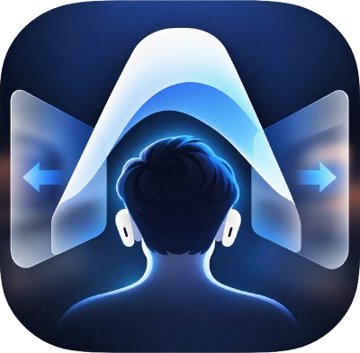
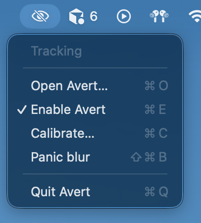
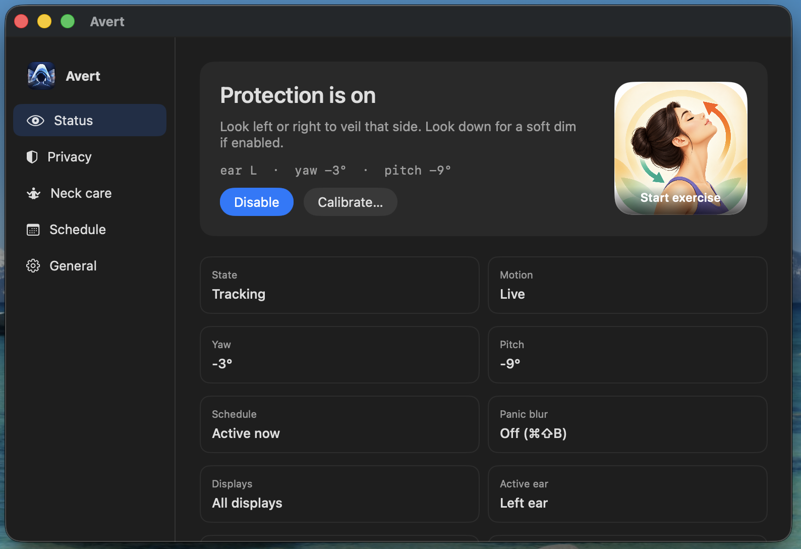
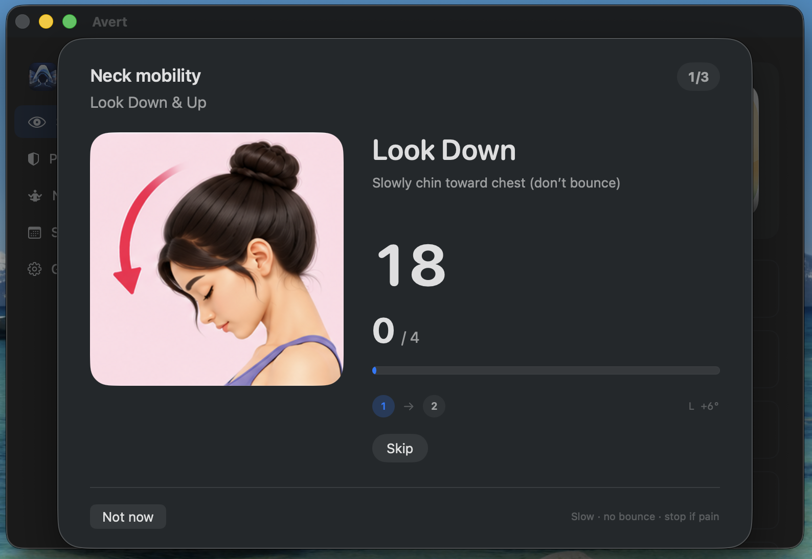
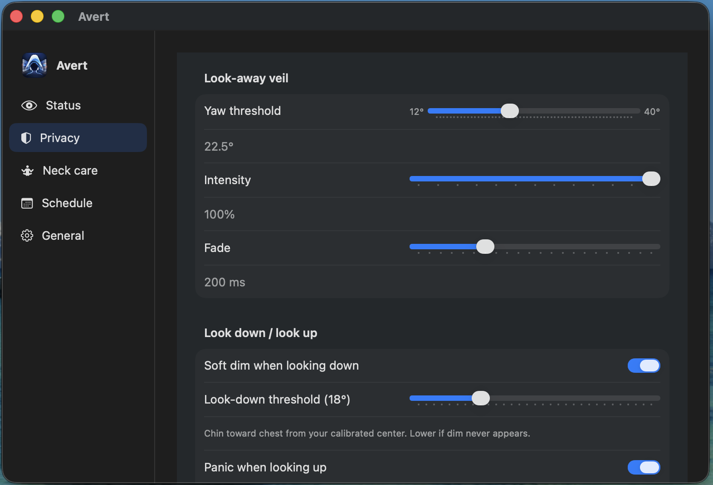
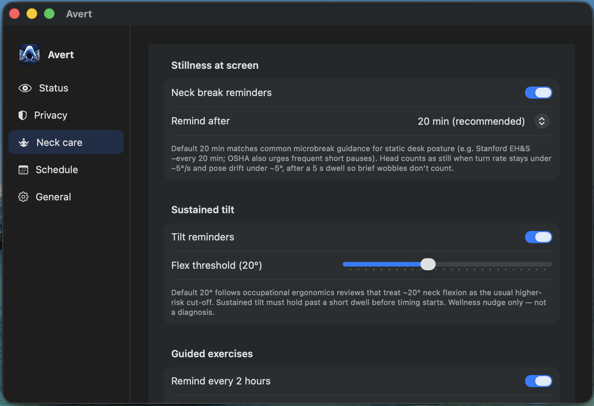
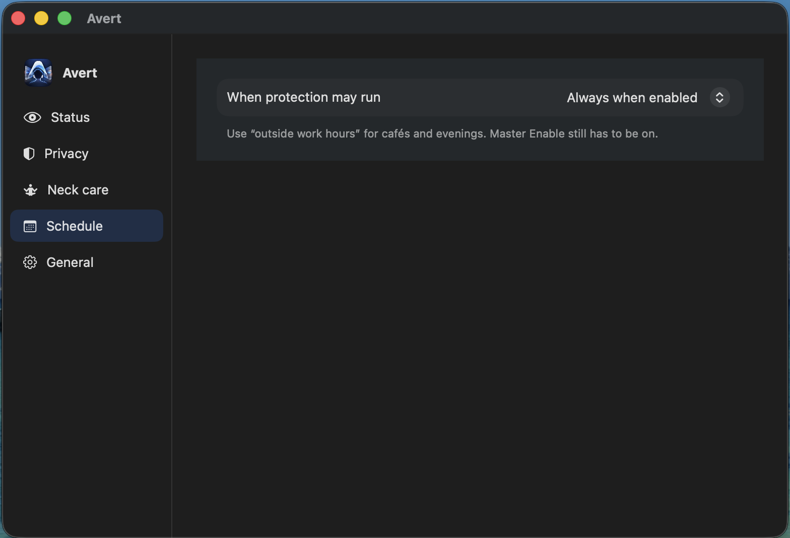
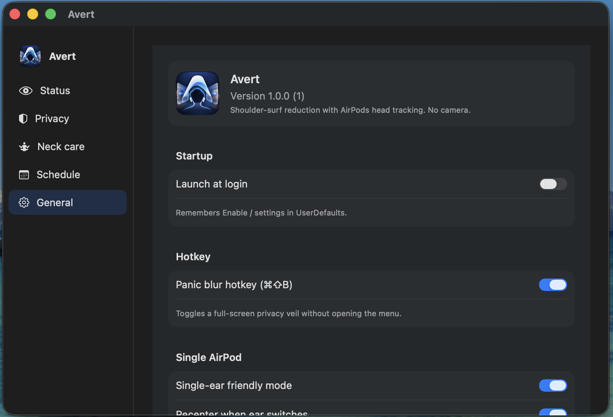

  

# Avert

**Site:** [wekex35.github.io/avert](https://wekex35.github.io/avert/) · **Download:** [notarized DMG](https://github.com/wekex35/avert/releases/download/v1.0.0-notarized/Avert-1.0.0-macos-notarized.dmg)

Avert lives in your Mac menu bar and soft-blurs your screen when you look away — so people beside you see less of what’s on it. It uses your AirPods’ head motion, not a camera.

---

## What it does

| When you… | Avert… |
|-----------|--------|
| Look left or right | Soft-blurs that side of the screen |
| Look down (optional) | Gently dims the whole screen |
| Look up (optional) | Covers the screen until you clear it |
| Press ⌘⇧B | Instant full-screen cover (panic blur) |
| Sit still too long | Can nudge you to take a neck break |
| Want a stretch | Guides a short neck exercise set |

Everything runs on your Mac. No account, no camera, no uploading of what you look at.

---

## Screenshots

  

| | |
|:---:|:---:|
|  **Status** |  **Neck exercise** |
|  **Privacy** |  **Neck care** |
|  **Schedule** |  **General** |

## Demo video

[Watch avert-demo.mp4](docs/demo/avert-demo.mp4) (~1 min) — Status, calibrate, neck care, privacy, general.

---

## Requirements

- A Mac on **macOS 14 Sonoma** or later  
- **AirPods** (or compatible Beats) that support head motion, worn in your ears  
- Allow **Motion & Fitness** when asked (needed for look-away blur)

Optional but helpful: Notifications (reminders), Bluetooth (bring AirPods back after a phone call), Launch at Login.

---

## Quick start

1. Open **Avert** — you’ll see its icon in the menu bar.  
2. Put your **AirPods** in and make sure audio is on this Mac.  
3. Click the menu bar icon → **Open Avert**, then turn **Enable** on.  
4. Follow the **calibration** steps: face the screen, then practice looking left, right, down, and up.  
5. Work as usual. Look left or right past a comfortable amount — that side should soft-blur. Look back to center — it clears.

That’s it. Recalibrate anytime from the menu or Status if your seating position changes.

---

## Features

### Privacy blur

- **Look-away veil** — Turning left or right soft-blurs that side; intensity grows as you turn further.  
- **Calibration** — Sets “facing the screen” as your center. First time you enable, Avert walks you through it.  
- **Look-down dim** — Optional soft dim when you look down (e.g. at your phone).  
- **Look-up cover** — Optional full cover when you look up; stays until you clear it (menu or ⌘⇧B).  
- **Panic blur** — Same full cover on demand (menu or **⌘⇧B**).  
- **Custom cover** — Use a solid black screen or your own image.  
- **Sensitivity** — Adjust how far you turn before blur kicks in, how strong it is, and how fast it fades (Privacy settings).

### Neck care

- **Stillness reminders** — If you’ve been facing the screen with little movement for a while, Avert can suggest a neck break.  
- **Posture nudge** — If your head stays tilted for a long stretch, you can get a gentle reset reminder.  
- **Guided exercises** — A short 3-move set (look down/up, tilt left/right, turn left/right) with on-screen guidance. Optional voice coach counts holds and reps.  
- **Exercise reminders** — Optional repeating reminder so you don’t forget to stretch.

Neck care is a wellness helper, not medical advice. Stop if anything hurts.

### AirPods & everyday use

- **Works while you wear them** — Tracking needs AirPods motion. Without it, look-away blur pauses; panic hotkey and settings still work.  
- **After a phone call** — If motion goes to your phone, Status may show “On call / other device.” Use **Bring AirPods to Mac** (or reconnect in Bluetooth) to resume.  
- **One ear** — Fine if you wear a single bud; Avert can follow which ear is active.  
- **Schedule** — Always on, only during work hours, or only outside work hours.  
- **Launch at login** — Optional, so Avert is ready when you start your Mac.  
- **Multiple displays** — Cover all screens or just the main one.

---

## User guide

### Menu bar

Click the Avert icon for:

| Item | What it does |
|------|----------------|
| **Status** | Quick view of tracking and protection |
| **Open Avert** (⌘O) | Opens the main window |
| **Enable** (⌘E) | Turns protection and tracking on or off |
| **Calibrate** (⌘C) | Sets or refreshes “facing the screen” |
| **Bring AirPods to Mac** | Appears when motion is elsewhere — tries to reclaim them |
| **Panic blur** (⌘⇧B) | Full-screen cover on / off |
| **Quit** (⌘Q) | Exits Avert (overlays go away) |

### Main window

Open Avert from the menu. Use the sidebar:

| Tab | Use it for |
|-----|------------|
| **Status** | Live state, Enable, Calibrate, Bring AirPods, Start exercise |
| **Privacy** | Blur sensitivity, look-down / look-up, panic cover image |
| **Neck care** | Break reminders, exercises, voice coach |
| **Schedule** | When protection is allowed to run |
| **General** | Launch at login, panic hotkey, about |

### Calibration tips

- Sit how you normally work, then calibrate facing the middle of the screen.  
- Recalibrate after you change chairs, desk height, or how the Mac is angled.  
- If blur feels “off center,” recalibrate — don’t fight the thresholds first.  
- Avert may gently suggest recalibrating if your usual pose drifts.

### Panic cover

- **⌘⇧B** or menu **Panic blur** toggles the full cover.  
- Look-up cover (if enabled) also sticks until you clear it the same way.  
- Looking down does **not** clear a panic cover.

### When blur doesn’t appear

1. Are AirPods in and connected to **this** Mac?  
2. Is **Enable** on?  
3. Have you **calibrated**?  
4. Did macOS allow **Motion & Fitness** for Avert?  
5. Check **Schedule** — protection may be paused outside your chosen hours.  
6. During a call, motion may be on the phone — reclaim AirPods when you’re done.

---

## Privacy in plain words

Avert uses AirPods motion on your Mac only. It does not use a camera, does not read other apps’ content, and does not send your head pose or screen to a server.

Full details: [Privacy policy](https://wekex35.github.io/avert/privacy.html) · [docs/PRIVACY.md](docs/PRIVACY.md).

---

## Version

**1.0.0**
